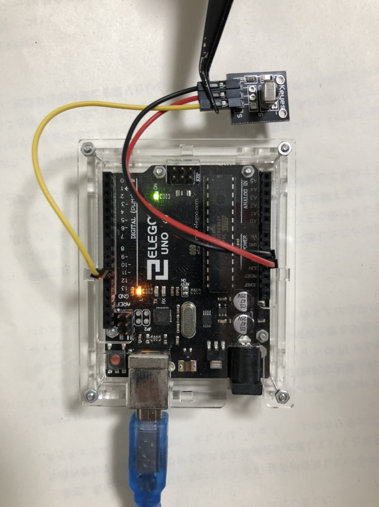
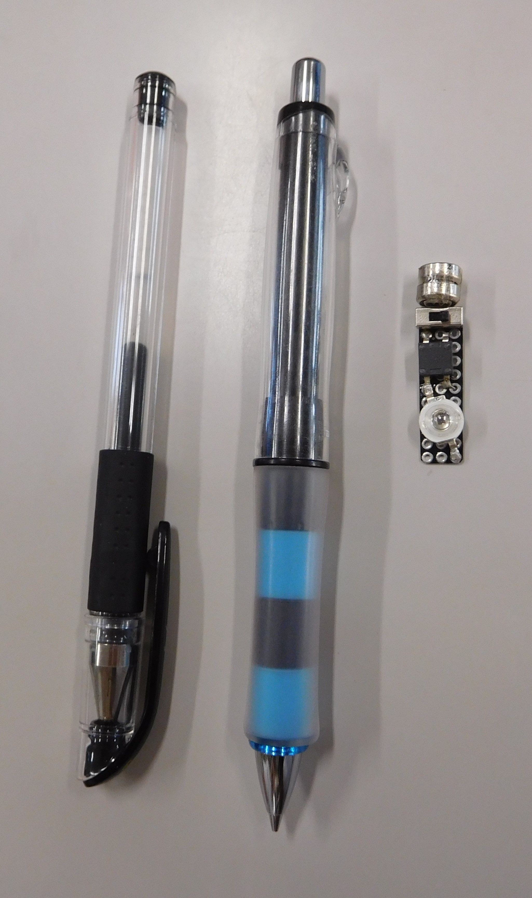
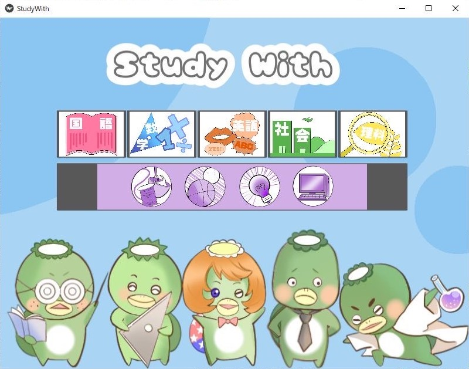
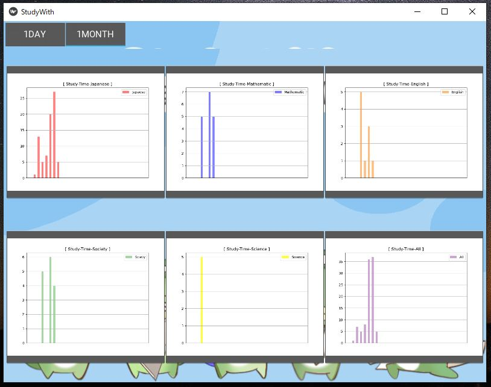
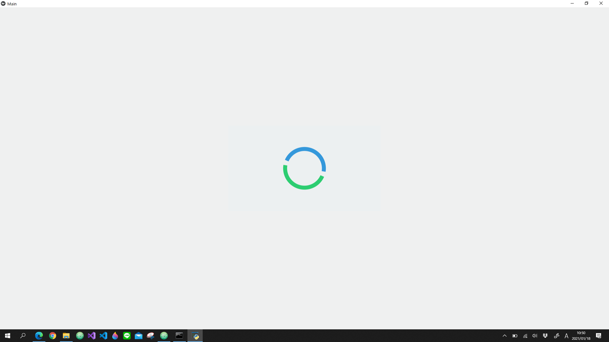
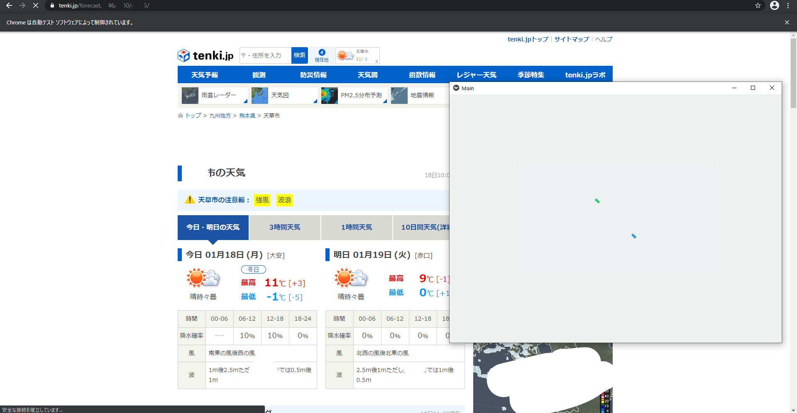
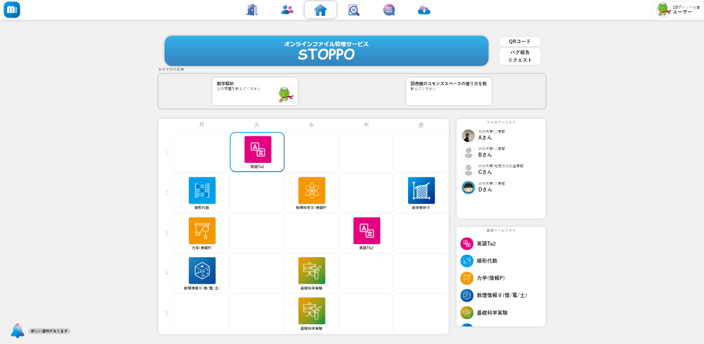

<h2>About Me</h2>

  
2002年生まれ大学１年生 
  

<h2>SKILS - (Language/Infra)</h2>

半年(強)間程，Webアプリ開発に熱中しており，それに伴いDjango,HTML,CSS,JavaScript,SQLの技術を習得しました． 
バックエンド　＞　フロントエンド． 
Webアプリのデプロイ・運用の為，AWS/Linuxサーバを使用しているため，インフラ周りも少し扱えるようになりました． 
つい最近競技プログラミングを始めた為，C++を使う機会が多くなりました． 
現在はC++でP2Pの仕組みを使ったサーバーレスな通信を行うシステム(ソフト)を作る事を目標にしています．

max:[☆☆☆☆☆]

<ul>
  <li><h3>Python [ ☆☆☆☆ ]</h3></li>
  <ul>
    <li>Django [ ☆☆☆☆ ]</li>
    <li>Flask [ ☆☆ ]</li>
    <li>Kivy [ ☆☆ ]</li>
  </ul> 
  
  <li><h3>C / C++ [ ☆☆☆ ]</h3></li>
  
  <li><h3>Java [ ☆ ]</h3></li>
  
  <li><h3>Swift [ ☆☆ ]</h3></li>
  
  <li><h3>HTML [ ☆☆☆☆ ]</h3></li>
  <li><h3>CSS [ ☆☆☆☆ ]</h3></li>
  <li><h3>JavaScript [ ☆☆ ]</h3></li>
  <ul>
    <li>jquery [ ☆☆☆ ]</li>
  </ul> 
  
  <li><h3>SQL [ ☆☆☆☆ ]</h3></li>
  <ul>
    <li>MySQL</li>
    <li>Redis</li>
  </ul>
  
  <li><h3>Infra</h3></li>
  <ul>
    <li><h3>Linux</h3></li>
    <ul>
      <li>Nginx</li>
      <li>Gunicorn</li>
      <li>Daphne</li>
    </ul>
  </ul>
</ul>

<h2>Production</h2>
<h3>①勉強時間記録ソフト(StudyWith)</h3>

  
  
  
  

ペンに傾斜センサーと赤外線発信機を載せた基盤と電池を搭載しています．ペンがある一定以上の傾斜角に達すると電流が流れ赤外線を発します． 
ペンから発信された赤外線センサーをarduinoに接続した赤外線感知器で受信し，その信号をPythonに渡すようにarduinoでコーディングしています． 
受信した信号はcsvファイルに記録され，結果一覧よりその時間をグラフとして確認する事が出来ます．

<h4>Language</h4>
<ul>
  <li>Python</li>
  <li>Kivy(python)</li>
  <li>Arduino言語</li>
</ul> 

<h3>②簡易スマートスピーカー</h3>

  
  

スピーカー(別)に話しかけ，その内容に応じてスピーカーが返答をします． 
AlexaやSiriの簡易的な装置です． 
返答内容によっては情報をスクレイピングしディスプレイに表示されます．
 
<h4>Language</h4>
<ul>
  <li>Python</li>
  <li>Kivy(python)</li>
</ul> 

<h3>③Webアプリ(Mi-Board)</h3>

  

大学生が講義について質問，ファイルをオンライン管理，ファイルシェア，交流 etc... 出来るWebアプリです． 
詳細は<a href="https://mi-board.com">Mi-Boardトップページ</a>をご確認ください． 
製作当初はFlaskを使ってましたが，想像していた以上に規模が大きくなりそうだったのでDjangoに移行しました． 
IOS向けアプリも製作しています． 
現在はβ版として発表しており，本格運用に向けてデータ収集，バグ修正をしています． 
※ソースコードは公開しておりません
 
<h4>Language</h4>
<ul>
  <li>Python</li>
  <li>Django</li>
  <li>HTML</li>
  <li>CSS</li>
  <li>JavaScript(jquery)</li>
  <li>Swift</li>
  <li>SQL</li>
</ul>

<h2>Future</h2>

①競技プログラミング技術を上げたいです．

②セキュリティ知識を増やしたいです．

③チーム開発をしてみたいです．

<!--
**y6-maenaka/y6-maenaka** is a ✨ _special_ ✨ repository because its `README.md` (this file) appears on your GitHub profile.

Here are some ideas to get you started:

- 🔭 I’m currently working on ...
- 🌱 I’m currently learning ...
- 👯 I’m looking to collaborate on ...
- 🤔 I’m looking for help with ...
- 💬 Ask me about ...
- 📫 How to reach me: ...
- 😄 Pronouns: ...
- ⚡ Fun fact: ...
-->
